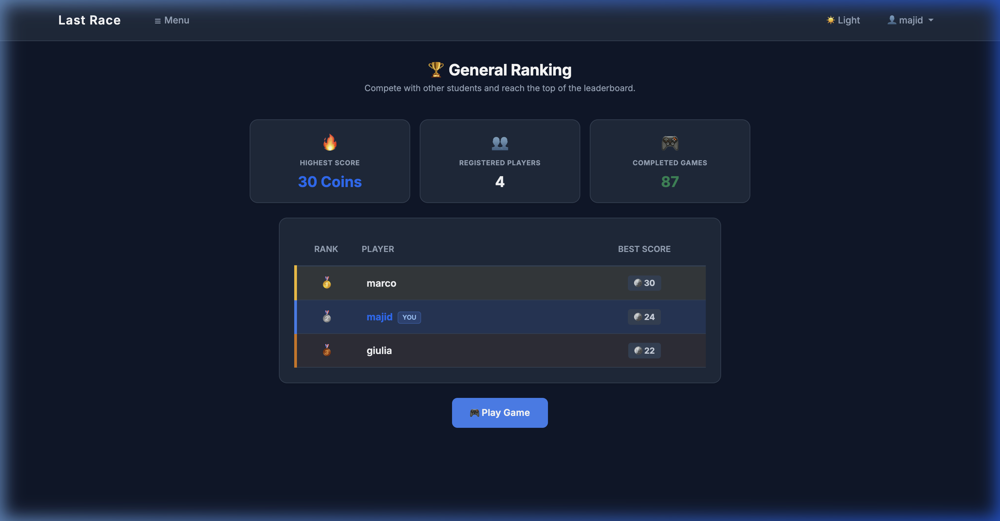
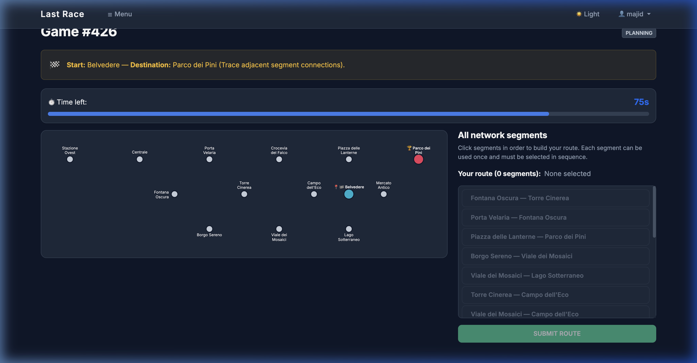

# Exam #1: "Last Race"
## Student: s360738 GOLESTANI MAJID

## React Client Application Routes

- Route `/`: game instructions for all visitors; registered users see a link to play.
- Route `/login`: login form (Passport session); redirects to `/play` when authenticated.
- Route `/play`: authenticated gameplay (setup → planning → execution → result).
- Route `/leaderboard`: general ranking of best scores per registered user.

## API Server

- `POST /api/login` — body `{ username, password }`; returns `{ id, username }` and sets session cookie.
- `POST /api/logout` — destroys session.
- `GET /api/session` — returns current user or 401.
- `GET /api/network` — **auth required**; full network (lines, stations, segments, interchanges).
- `GET /api/leaderboard` — **auth required**; `{ ranking: [{ username, best_score }] }`.
- `POST /api/games` — **auth required**; creates a game (phase `setup`, 20 coins, random start/dest ≥3 segments).
- `GET /api/games/:id` — **auth required**; current game state for the logged-in user.
- `POST /api/games/:id/planning` — **auth required**; starts planning (90s timer); returns game + station list + segment pairs (no line geometry).
- `PUT /api/games/:id/route` — **auth required**; body `{ route: [{ stationAId, stationBId }, ...] }`; validates, runs events, returns game in `result` phase.
- `POST /api/games/:id/timeout` — **auth required**; body `{ route }`; auto-submits partial route when planning time expires.

## Database Tables

- `users` — registered players; bcrypt password hashes.
- `lines` — metro line name and display color.
- `stations` — station name and map coordinates.
- `line_stations` — ordered stations per line (defines topology).
- `segments` — adjacent station pairs per line (used for route validation).
- `events` — random event description and coin effect (−4…+4).
- `games` — per-user game state, route, execution log, and final score.

## Main React Components

- `Layout` (`Layout.jsx`): navbar, login/logout, navigation.
- `NetworkMap` (`NetworkMap.jsx`): SVG map with optional lines and station labels.
- `SegmentPicker` (`SegmentPicker.jsx`): scrollable segment list and route builder during planning.
- `PlayPage` (`PlayPage.jsx`): orchestrates setup, planning timer, execution steps, and result.
- `AuthContext` (`AuthContext.jsx`): session state and login/logout helpers.

## Screenshot

Add two images under `img/` before submission:

## Users Credentials

- `marco` / `metro2026!`
- `giulia` / `rails456`
- `luca` / `lastrace1`
- `majid` / `MjQ11@`

## Game Features

- User authentication
- Interactive metro map
- Route planning
- Timer
- Random events
- Leaderboard
- Game history
- SQLite database

## Use of AI Tools

I used Chat Gpt as a development assistant during the project. It helped me with project scaffolding, API structure suggestions, and generating some React components.

However, all generated code was manually reviewed, modified when necessary, and integrated by me into the final application. I personally verified the core functionality of the project, including route validation, station interchange handling, distance calculations, authentication, game logic, and compliance with the exam requirements.

AI was used as a support tool to improve development efficiency, while all design decisions, debugging, testing, and final implementation choices were made and validated by me.
